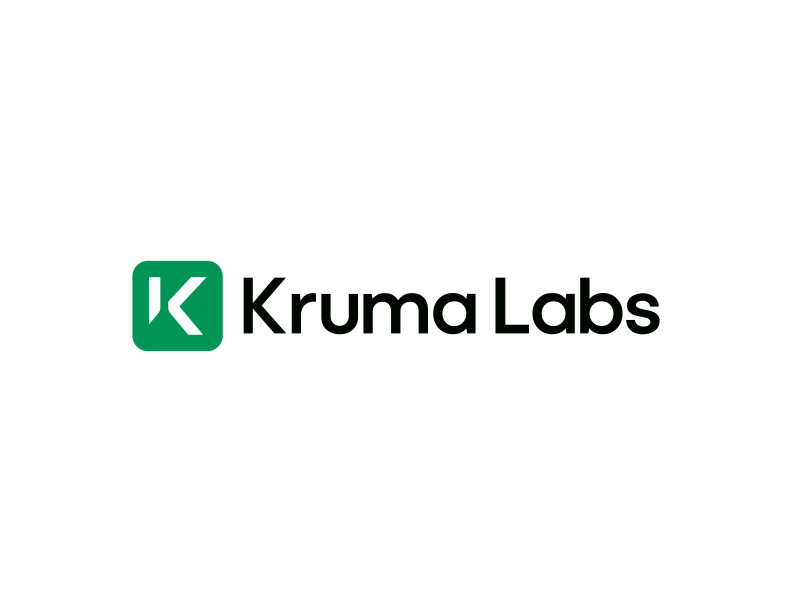

# KrumaLabs Next.js Starter Template

<div align="center">
  
  <h3 align="center">A Modern Next.js Starter Template</h3>
</div>

## 🚀 Features

- ⚡️ **Next.js 15** - The latest version of Next.js for optimal performance
- 🎨 **Tailwind CSS** - A utility-first CSS framework
- 🎯 **Shadcn UI** - High-quality, customizable components
- 📝 **ESLint** - Pluggable JavaScript linter
- 🔍 **TypeScript** - Static type checking
- 📱 **Responsive Design** - Mobile-first approach
- 🎭 **Modern UI/UX** - Clean and intuitive user interface

## 📦 Getting Started

1. Clone this template:
```bash
pnpm create next-app -e https://github.com/theodenanyoh11/krumalabs-nextjs-starter
```

2. Install dependencies:
```bash
pnpm install
```

3. Run the development server:
```bash
pnpm dev
```

4. Open [http://localhost:3000](http://localhost:3000) with your browser to see the result.

## 🛠️ Tech Stack

- **Framework:** Next.js 15
- **Styling:** Tailwind CSS
- **UI Components:** Shadcn UI
- **Language:** TypeScript
- **Linting:** ESLint

## 📝 Project Structure

```
├── app/                # Next.js app directory
├── components/         # Reusable components
├── public/            # Static assets
├── styles/           # Global styles
└── types/            # TypeScript types
```

## 🔗 Links

- [KrumaLabs Innovation Lab](https://www.krumalabs.com)
- [Next.js Documentation](https://nextjs.org/docs)
- [Tailwind CSS Documentation](https://tailwindcss.com/docs)
- [Shadcn UI Documentation](https://ui.shadcn.com)

## 📄 License

This project is licensed under the MIT License.

## 🙏 Credits

Created by [KrumaLabs Innovation Lab](https://www.krumalabs.com)
